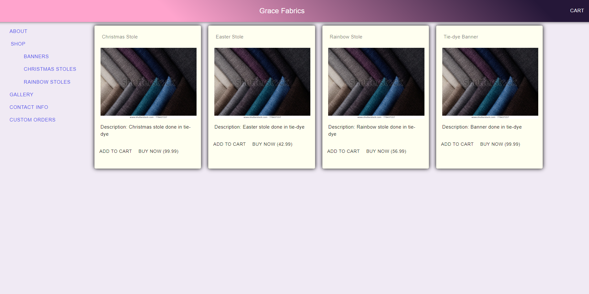

  # Title Grace Fabrics
 
===========================================
  ## Description
  E-commerce website which allows users to browse a selection of product offerings and create custom orders which they can email to the site's owner. This website also employs a single sign on for the site administrator allowing the owner to modify product inventory.
===========================================
  ## Table of Contents
  - [Description](#Description)
  - [Installation-Instructions](#Installation-Instructions)
  - [Contribution-Guidelines](#Contribution-Guidelines)
  - [Usage-Information](#Usage-Information)
  - [Feedback](#Feedback)
  - [License](#License)

The deployed app can be seen here: (add link to deployed heroku site)

  ## Installation-Instructions
  Download and extract the repo then run npm install

  ## Usage-Information
  Used by Site Owner for sales

  ## Contribution-Guidelines
  To contribute to this project feel free to contact us using any of the contact information listed below.

  ## Feedback 
  For questions or information about this README generator, we can be reached at:
  jbenningfield.dev@gmail.com 
  
  Find us on GitHub here: https://www.github.com/ubern00bie
  
  ## License
  Copyright (c) 2020 Aurora Brune, Jordan Benningfield, Jourdan Case, Anthony Stematz-Breitling

  Permission is hereby granted, free of charge, to any person obtaining a copy
  of this software and associated documentation files (the "Software"), to deal
  in the Software without restriction, including without limitation the rights
  to use, copy, modify, merge, publish, distribute, sublicense, and/or sell
  copies of the Software, and to permit persons to whom the Software is
  furnished to do so, subject to the following conditions:

  The above copyright notice and this permission notice shall be included in all
  copies or substantial portions of the Software.

  THE SOFTWARE IS PROVIDED "AS IS", WITHOUT WARRANTY OF ANY KIND, EXPRESS OR
  IMPLIED, INCLUDING BUT NOT LIMITED TO THE WARRANTIES OF MERCHANTABILITY,
  FITNESS FOR A PARTICULAR PURPOSE AND NONINFRINGEMENT. IN NO EVENT SHALL THE
  AUTHORS OR COPYRIGHT HOLDERS BE LIABLE FOR ANY CLAIM, DAMAGES OR OTHER
  LIABILITY, WHETHER IN AN ACTION OF CONTRACT, TORT OR OTHERWISE, ARISING FROM,
  OUT OF OR IN CONNECTION WITH THE SOFTWARE OR THE USE OR OTHER DEALINGS IN THE
  SOFTWARE.
